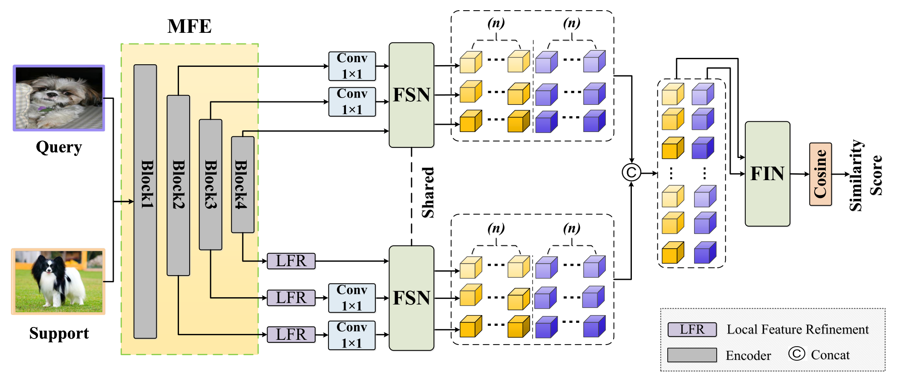

# Multi-Scale-Feature-Selection-and-Interaction-Network


## :heavy_check_mark: Requirements
* Ubuntu 16.04
* Python 3.7
* [CUDA 12.1](https://developer.nvidia.com/cuda-toolkit)
* [PyTorch 1.12.0](https://pytorch.org)

## Data Preparation
  
The following datasets are used in our paper:

UC Merced Land: [Dataset Page](http://weegee.vision.ucmerced.edu/datasets/landuse.html)

WHU-RS19：[Dataset Page](https://study.rsgis.whu.edu.cn/pages/download/building_dataset.html)

AID：[Dataset Page](https://captain-whu.github.io/AID/)

Stanford Dogs: [Dataset Page](http://vision.stanford.edu/aditya86/ImageNetDogs/)

Stanford Cars: [Dataset Page](https://drive.google.com/file/d/1ImEPQH5gHpSE_Mlq8bRvxxcUXOwdHIeF/view)

CUB_200_2011: [Dataset Page](https://www.vision.caltech.edu/datasets/cub_200_2011/)

### Train
Running the shell script ```train.sh``` will train the model with hyperparameters matching our paper.

### Test
Running the shell script ```test.sh``` will evaluate the model with hyperparameters matching our paper.

## Modifications (Reproduction Fixes)

This fork tightens the implementation against the paper without changing any
formula, loss function, or hyper-parameter (`lamb=1.5`, `temperature=0.2`,
`temperature_attn=2.0`, `num_token=4`, `lr=0.1`, `milestones=[60, 70]`,
`batch=64`, `max_epoch=80`, `weight_decay=0.0005`, `momentum=0.9`).

| # | Where | Change | Reason |
|---|-------|--------|--------|
| 1 | `common/utils.py` | Default `gamma`: `0.05` → `0.1` | Paper §4.2 explicitly states *"reduced **tenfold** every 10 epochs"*; the previous `0.05` corresponds to a 20-fold drop and starves late-epoch fine-tuning. |
| 2 | `common/utils.py` | Default `val_episode`: `200` → `600` | 200-episode validation has ~±1.5% standard error, often picking a sub-optimal checkpoint. |
| 3 | `common/utils.py` | Added `-test_seed` (default `2024`) | Makes the test sampler reproducible across runs of the same checkpoint. |
| 4 | `common/utils.py` | Consolidated duplicate `load_model` | The shadowed second version silently dropped mismatched keys; replaced with a single robust loader that handles `module.` prefix and warns on missing keys. |
| 5 | `train.py` | Track top-3 best-val checkpoints (`topk_epoch*.pth`) | Cheap insurance against the noisy online val signal overwriting a truly better checkpoint. |
| 6 | `test.py` | Re-rank all candidate checkpoints on a 1200-episode fixed validation set, then test the winner | Selects the checkpoint that the small online val set may have missed. |
| 7 | `test.py` | Standalone entry instantiates `MSFIN` instead of `RENet` | The previous code instantiated the wrong model when running `python test.py` directly. |

Running `train.sh` / `test.sh` as-is now applies all the fixes above
(both scripts already omit `-gamma`/`-val_episode`, so the new defaults take effect).
